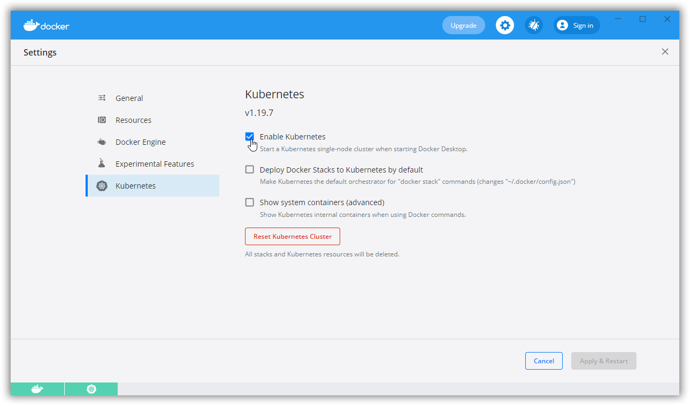

# BuildCloudNativeApplicationsWithDotNet5-DotNextPiter-2021
Repository containing guidance and code to use during the DotNext Piter 2021 workshop: "Building Cloud Native applications with .NET 5 and AKS"

## Presentation

[Presentation Slides](DOTNEXT-Building-Cloud-Native-Applications-with-DOTNET-and-AKS.pdf)

## Prerequisites

Please prepare your system and install the following software:

- [.NET 5 SDK 5.0.202](https://dotnet.microsoft.com/download/dotnet/5.0)
- [Visual Studio Code](https://code.visualstudio.com/)
- [Azure CLI](https://docs.microsoft.com/en-us/cli/azure/install-azure-cli-windows?tabs=azure-cli)
- [Docker Desktop](https://www.docker.com/products/docker-desktop)
- [Helm](https://github.com/helm/helm/releases)

Additionally, prepare the following settings and extensions:

### Docker Desktop

Prepare the following settings:

### Visual Studio Code

Install the following extensions:

- [YAML](https://marketplace.visualstudio.com/items?itemName=redhat.vscode-yaml)
- [C#](https://marketplace.visualstudio.com/items?itemName=ms-dotnettools.csharp)
- [dotnet](https://marketplace.visualstudio.com/items?itemName=leo-labs.dotnet)
- [NuGet Package Manager](https://marketplace.visualstudio.com/items?itemName=jmrog.vscode-nuget-package-manager)
- [Azure Account](https://marketplace.visualstudio.com/items?itemName=ms-vscode.azure-account)
- [Azure CLI Tools](https://marketplace.visualstudio.com/items?itemName=ms-vscode.azurecli)
- [Docker](https://marketplace.visualstudio.com/items?itemName=ms-azuretools.vscode-docker)
- [Kubernetes](https://marketplace.visualstudio.com/items?itemName=ms-kubernetes-tools.vscode-kubernetes-tools)
- [Kubernetes Support](https://marketplace.visualstudio.com/items?itemName=ipedrazas.kubernetes-snippets)

## Workshop

### Part 1 - Cloud Native with .NET 5

- [Step 01](step-01.md) - Create a .NET 5 HTTP Service (ASP.NET WebApi).
- [Step 02](step-02.md) - Create a .NET 5 Worker Service that calls the HTTP Service.
- [Step 03](step-03.md) - Test your Worker Service and HTTP Service using Project Tye.
- [Step 04](step-04.md) - Project Tye and custom configuration.
- [Step 05](step-05.md) - Create a .NET 5 gRPC Service and Client.
- [Step 06](step-06.md) - Changing the gRPC Service and Client to use a common part.
- [Step 07](step-07.md) - Putting everything together with custom configuration.

### Part 2 - Containerize your services with Docker

- [Step 08](step-08.md) - Project Tye and additional Docker containers.
- [Step 09](step-09.md) - Test step.
- [Step 10](step-10.md) - Test step.

### Part 3 - Deploy your containerized services on AKS

- [Step 01](step-01.md) - Test step.
- [Step 01](step-01.md) - Test step.