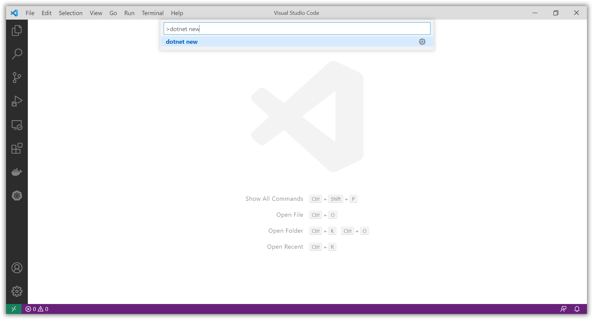
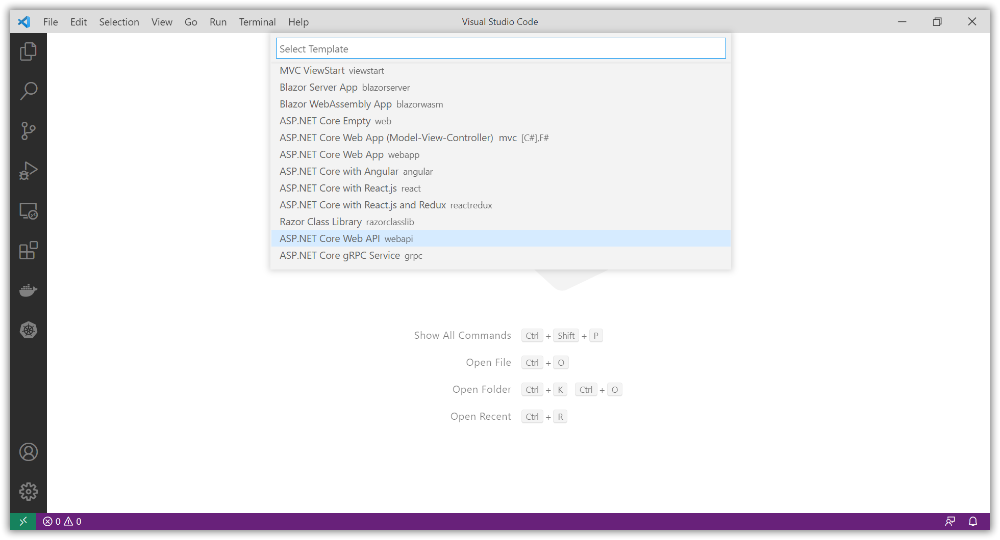
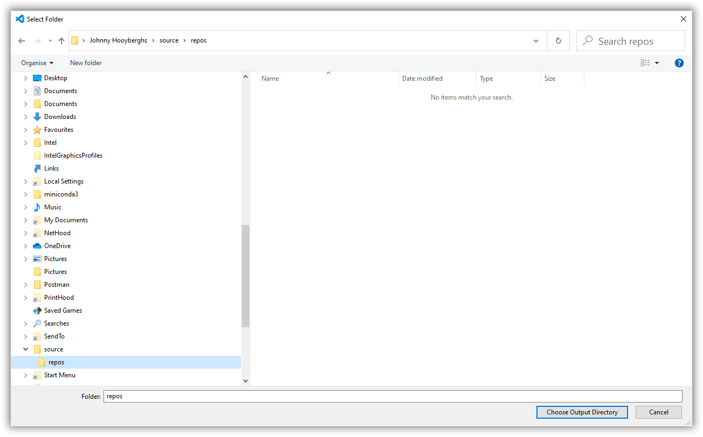
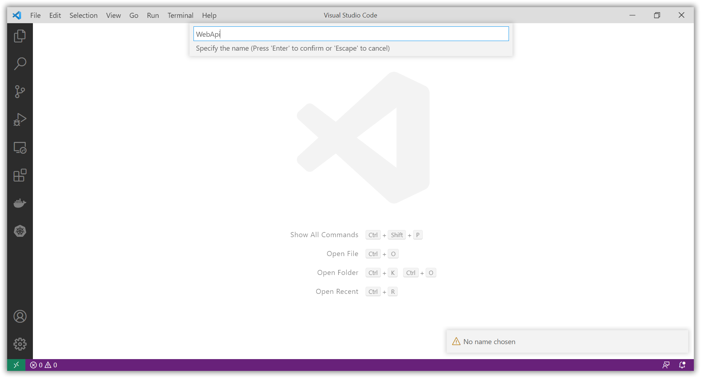
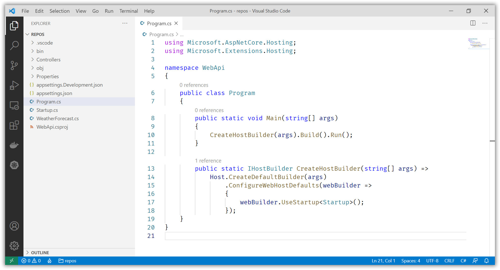
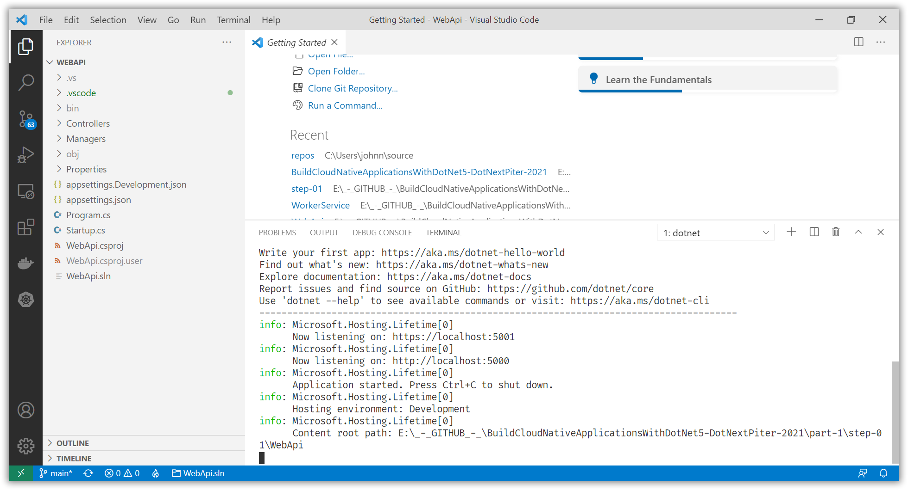
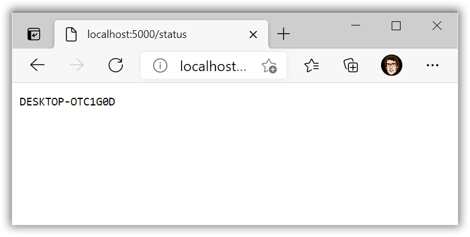

# Create a .NET 5 HTTP Service (ASP.NET WebApi)

[Next step](step-02.md)

You can use Visual Studio Code to create a new .NET 5 WebApi project:











Add the source code from [this repository](part-1/step-01/WebApi) to your project.

[ApiControllerBase.cs](part-1/step-01/WebApi/Controllers/Base/ApiControllerBase.cs)

```csharp
using Microsoft.AspNetCore.Mvc;
using Microsoft.Extensions.Logging;
using System;
using System.Threading.Tasks;

namespace WebApi.Controllers.Base
{
    public class ApiControllerBase<TController, TManager> : ControllerBase
    {
        private readonly TManager _manager;
        private readonly ILogger<TController> _logger;

        public ApiControllerBase(
            TManager manager,
            ILogger<TController> logger)
        {
            _manager = manager;
            _logger = logger;
        }

        public async Task<IActionResult> Execute<TResult>(Func<TManager, Task<TResult>> managerCall)
        {
            try
            {
                var result = await managerCall(_manager);
                return Ok(result);
            }
            catch (Exception ex)
            {
                _logger.LogError($"Something went seriously wrong: {ex.Message}");
                return StatusCode(500, "Something went seriously wrong!");
            }
        }
    }
}
```

[StatusManager.cs](part-1/step-01/WebApi/Managers/StatusManager.cs)

```csharp
using System;
using System.Threading.Tasks;

namespace WebApi.Managers
{
    public interface IStatusManager
    {
        Task<string> GetMachineName();
    }

    public class StatusManager : IStatusManager
    {
        public async Task<string> GetMachineName()
        {
            await Task.Delay(1000);
            return Environment.MachineName;
        }
    }
}
```

[StatusController.cs](part-1/step-01/WebApi/Controllers/StatusController.cs)

```csharp
using WebApi.Controllers.Base;
using WebApi.Managers;
using Microsoft.AspNetCore.Mvc;
using Microsoft.Extensions.Logging;
using System.Threading.Tasks;

namespace WebApi.Controllers
{
    [ApiController]
    [Route("[controller]")]
    public class StatusController : ApiControllerBase<StatusController, IStatusManager>
    {
        public StatusController(
            IStatusManager statusManager,
            ILogger<StatusController> logger) : base(statusManager, logger) { }

        [HttpGet]
        public Task<IActionResult> GetStatus()
        {
            return Execute(x => x.GetMachineName());
        }
    }
}
```

[Startup.cs](part-1/step-01/WebApi/Startup.cs)

```csharp
using WebApi.Managers;
using Microsoft.AspNetCore.Builder;
using Microsoft.AspNetCore.Hosting;
using Microsoft.Extensions.DependencyInjection;
using Microsoft.Extensions.Hosting;

namespace WebApi
{
    public class Startup
    {
        public void ConfigureServices(IServiceCollection services)
        {
            services.AddControllers();
            services.AddScoped<IStatusManager, StatusManager>();
        }

        public void Configure(IApplicationBuilder app, IWebHostEnvironment env)
        {
            if (env.IsDevelopment())
            {
                app.UseDeveloperExceptionPage();
            }

            app.UseRouting();
            app.UseAuthorization();
            app.UseEndpoints(endpoints =>
            {
                endpoints.MapControllers();
            });
        }
    }
}
```

Run your application by executing the ```dotnet run``` commmand:





[Next step](step-02.md)