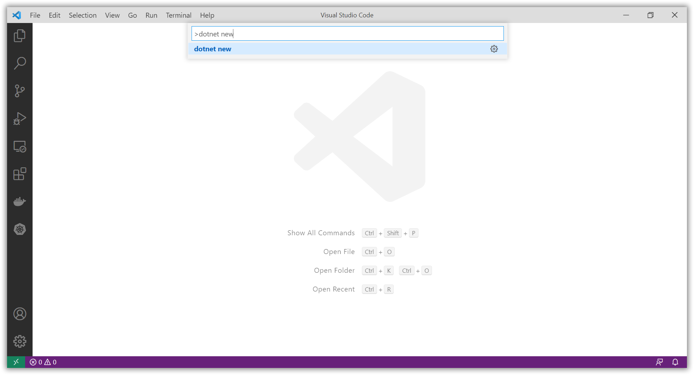

# Create a .NET 5 Worker Service that calls the HTTP Service

[Previous step](step-01.md) - [Next step](step-03.md)

[Link to example code inside this repository](part-1/step-02/)

You can use Visual Studio Code to create a new .NET 5 Worker Service project:




Add the source code from [this repository](part-1/step-02/WorkerService) to your project.

[WebApiClient.cs](part-1/step-02/WorkerService/WebApiClient.cs)

```csharp
using RestSharp;
using System.Threading.Tasks;

namespace WorkerService
{
    public interface IWebApiClient
    {
        Task<string> GetStatus();
    }

    public class WebApiClient : IWebApiClient
    {
        public async Task<string> GetStatus()
        {
            var restClient = new RestClient("http://localhost:5000");
            var restRequest = new RestRequest("status", Method.GET);
            var response = await restClient.ExecuteAsync<string>(restRequest);
            return response.Content;
        }
    }
}
```

[Worker.cs](part-1/step-02/WorkerService/Worker.cs)

```csharp
using Microsoft.Extensions.Hosting;
using Microsoft.Extensions.Logging;
using System.Threading;
using System.Threading.Tasks;

namespace WorkerService
{
    public class Worker : BackgroundService
    {
        private readonly IWebApiClient _webApiClient;
        private readonly ILogger<Worker> _logger;

        public Worker(
            IWebApiClient webApiClient,
            ILogger<Worker> logger)
        {
            _webApiClient = webApiClient;
            _logger = logger;
        }

        protected override async Task ExecuteAsync(CancellationToken stoppingToken)
        {
            while (!stoppingToken.IsCancellationRequested)
            {
                var status = await _webApiClient.GetStatus();
                _logger.LogInformation(status);

                await Task.Delay(10000, stoppingToken);
            }
        }
    }
}
```

[Program.cs](part-1/step-02/WorkerService/Program.cs)

```csharp
using Microsoft.Extensions.DependencyInjection;
using Microsoft.Extensions.Hosting;

namespace WorkerService
{
    public class Program
    {
        public static void Main(string[] args)
        {
            CreateHostBuilder(args).Build().Run();
        }

        public static IHostBuilder CreateHostBuilder(string[] args) =>
            Host.CreateDefaultBuilder(args)
                .ConfigureServices((hostContext, services) =>
                {
                    services.AddSingleton<IWebApiClient, WebApiClient>();
                    services.AddHostedService<Worker>();
                });
    }
}
```

Run both WebApi and WorkerService applications by executing the ```dotnet run``` commmand:


[Previous step](step-01.md) - [Next step](step-03.md)