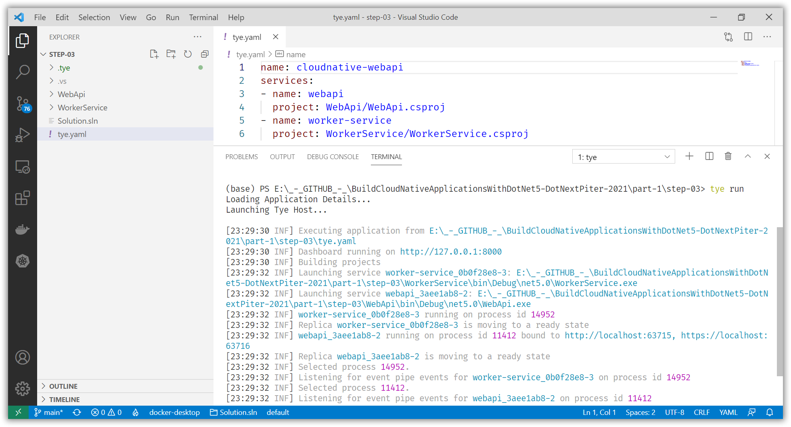
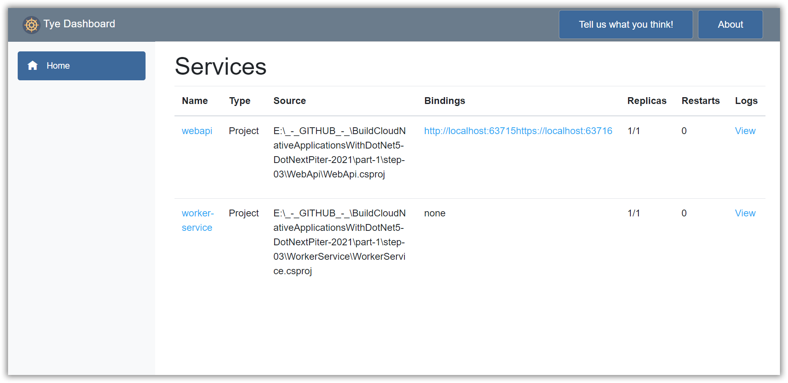
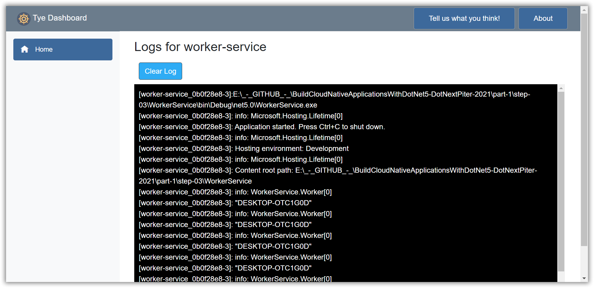

# Test your Worker Service and HTTP Service using Project Tye

[Previous step](step-02.md) - [Next step](step-04.md)

Install [Project Tye](https://github.com/dotnet/tye/blob/main/docs/getting_started.md) on your local system:

```
dotnet tool install -g Microsoft.Tye --version "0.6.0-alpha.21070.5"
```

Update your WorkerService project to support configuration using Project Tye

[WorkerService.csproj](part-1/step-03/WorkerService/WorkerService.csproj)

```xml
<Project Sdk="Microsoft.NET.Sdk.Worker">

  <PropertyGroup>
    <TargetFramework>net5.0</TargetFramework>
    <UserSecretsId>dotnet-WorkerService-F47A1FEB-1F5D-426D-BF50-F7977E113B0D</UserSecretsId>
  </PropertyGroup>

  <ItemGroup>
    <PackageReference Include="Microsoft.Extensions.Hosting" Version="5.0.0" />
    <PackageReference Include="Microsoft.Tye.Extensions.Configuration" Version="0.6.0-alpha.21070.5" />
    <PackageReference Include="RestSharp" Version="106.11.7" />
  </ItemGroup>
</Project>
```

Update your WebApiClient to get the WebApi service URI from Tye:

[WebApiClient.cs](part-1/step-03/WorkerService/WebApiClient.cs)

```csharp
using Microsoft.Extensions.Configuration;
using RestSharp;
using System.Threading.Tasks;

namespace WorkerService
{
    public interface IWebApiClient
    {
        Task<string> GetStatus();
    }

    public class WebApiClient : IWebApiClient
    {
        private readonly IConfiguration _configuration;

        public WebApiClient(IConfiguration configuration)
        {
            _configuration = configuration;
        }

        public async Task<string> GetStatus()
        {
            var restClient = new RestClient(_configuration.GetServiceUri("webapi"));
            var restRequest = new RestRequest("status", Method.GET);
            var response = await restClient.ExecuteAsync<string>(restRequest);
            return response.Content;
        }
    }
}
```

Create a YAML configuration file in the root directory to configure Project Tye:

[tye.yaml](part-1/step-03/tye.yaml)

```yaml
name: cloudnative-webapi
services:
- name: webapi
  project: WebApi/WebApi.csproj
- name: worker-service
  project: WorkerService/WorkerService.csproj
```

Open the root folder in Visual Studio Code and use the terminal to run your services using Tye:

```
tye run
```



Take a look at the Tye Dashboard to inspect your running services:





[Previous step](step-02.md) - [Next step](step-04.md)