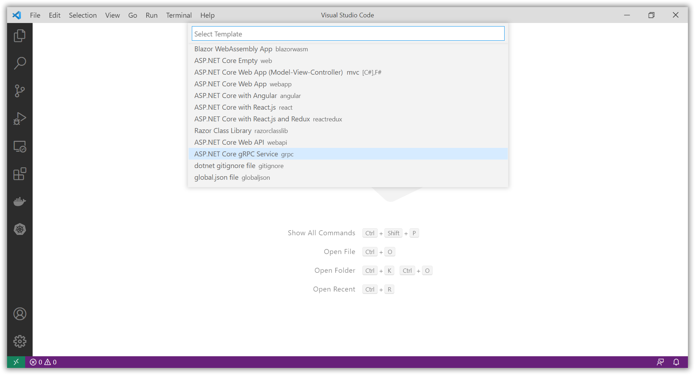
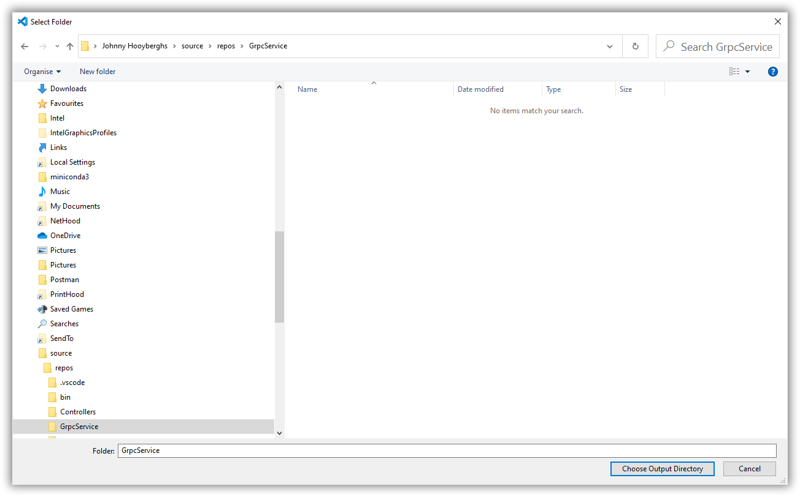
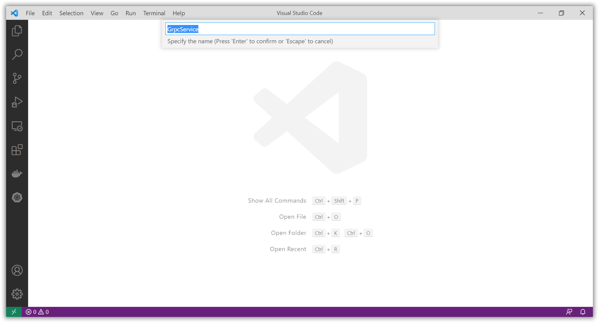
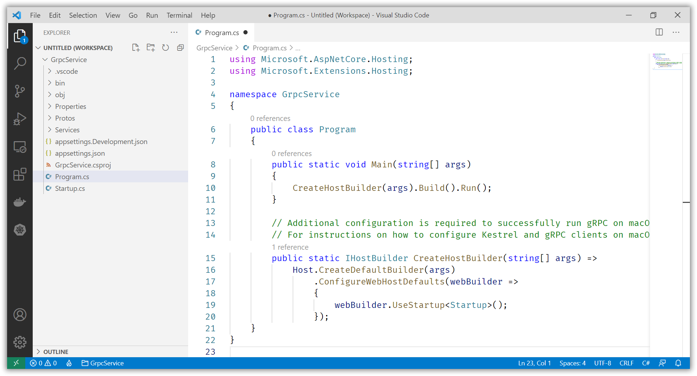
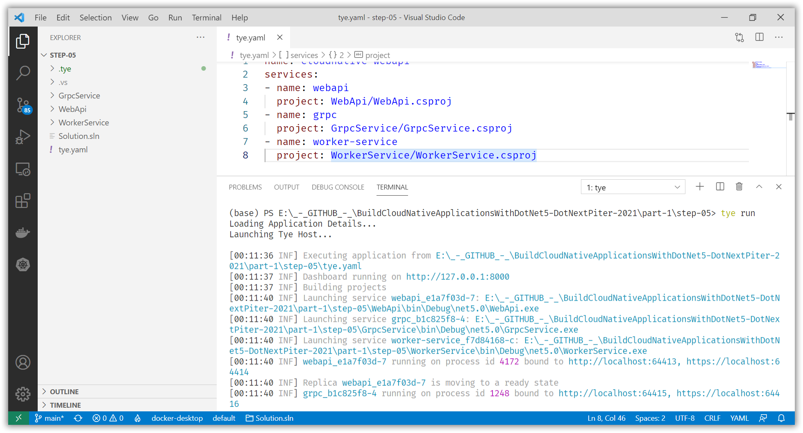
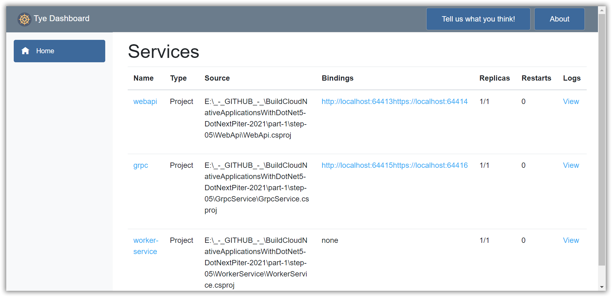
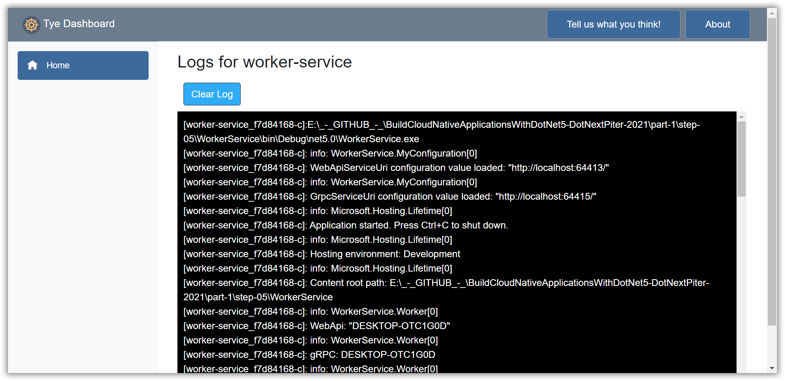

# Create a .NET 5 gRPC Service and Client

[Previous step](step-04.md) - [Next step](step-06.md)

You can use Visual Studio Code to create a new .NET 5 gRPC Service project:










Rename the greet.proto file to status.proto and update its content:

[status.proto](part-1/step-05/GrpcService/Protos/status.proto)

```csharp
syntax = "proto3";

option csharp_namespace = "GrpcService";

package status;

// The greeting service definition.
service Status
{
  // Sends a greeting
  rpc GetStatus (StatusRequest) returns (StatusResponse);
}

// The request message containing the user's name.
message StatusRequest
{
}

// The response message containing the greetings.
message StatusResponse
{
  string message = 1;
}
```

Rename the GreeterService.cs file to StatusService.cs and update its content:

[StatusService.cs](part-1/step-05/GrpcService/Services/StatusService.cs)

```csharp
using Grpc.Core;
using Microsoft.Extensions.Logging;
using System;
using System.Threading.Tasks;

namespace GrpcService
{
    public class StatusService : Status.StatusBase
    {
        private readonly ILogger<StatusService> _logger;

        public StatusService(ILogger<StatusService> logger)
        {
            _logger = logger;
        }

        public override async Task<StatusResponse> GetStatus(StatusRequest request, ServerCallContext context)
        {
            await Task.Delay(1000);

            return new StatusResponse
            {
                Message = Environment.MachineName
            };
        }
    }
}
```

Add the same status.proto file to the WorkerService project (as a link, or as a copy) and update the WorkerService.csproj to include the NuGet packages needed to create a gRPC client:

[WorkerService.csproj](part-1/step-05/WorkerService/WorkerService.csproj)

```xml
<Project Sdk="Microsoft.NET.Sdk.Worker">

  <PropertyGroup>
    <TargetFramework>net5.0</TargetFramework>
    <UserSecretsId>dotnet-WorkerService-F47A1FEB-1F5D-426D-BF50-F7977E113B0D</UserSecretsId>
  </PropertyGroup>

  <ItemGroup>
    <PackageReference Include="Google.Protobuf" Version="3.15.8" />
    <PackageReference Include="Grpc.Net.Client" Version="2.36.0" />
    <PackageReference Include="Grpc.Tools" Version="2.36.4">
      <PrivateAssets>all</PrivateAssets>
      <IncludeAssets>runtime; build; native; contentfiles; analyzers; buildtransitive</IncludeAssets>
    </PackageReference>
    <PackageReference Include="Microsoft.Extensions.Hosting" Version="5.0.0" />
    <PackageReference Include="Microsoft.Tye.Extensions.Configuration" Version="0.6.0-alpha.21070.5" />
    <PackageReference Include="RestSharp" Version="106.11.7" />
  </ItemGroup>

  <ItemGroup>
    <Folder Include="Protos\" />
  </ItemGroup>

  <ItemGroup>
    <Protobuf Include="..\GrpcService\Protos\status.proto" Link="Protos\status.proto" GrpcServices="Client" />
  </ItemGroup>
</Project>
```

Create a gRPC client for the WorkerService:

[GrpcClient.cs](part-1/step-05/WorkerService/GrpcClient.cs)

```csharp
using Grpc.Net.Client;
using System.Threading.Tasks;
using GrpcService;

namespace WorkerService
{
    public interface IGrpcClient
    {
        Task<string> GetStatus();
    }

    public class GrpcClient : IGrpcClient
    {
        private readonly IMyConfiguration _configuration;

        public GrpcClient(IMyConfiguration configuration)
        {
            _configuration = configuration;
        }

        public async Task<string> GetStatus()
        {
            var grpcChannel = GrpcChannel.ForAddress(_configuration.GrpcServiceUri);
            var grpcClient = new Status.StatusClient(grpcChannel);
            var response = await grpcClient.GetStatusAsync(new StatusRequest());
            return response.Message;
        }
    }
}
```

Update the custom configuration to include the service URI for gRPC:

[MyConfiguration.cs](part-1/step-05/WorkerService/MyConfiguration.cs)

```csharp
using Microsoft.Extensions.Configuration;
using Microsoft.Extensions.Logging;

namespace WorkerService
{
    public interface IMyConfiguration
    {
        string WebApiServiceUri { get; }
        string GrpcServiceUri { get; }
    }

    public class MyConfiguration : IMyConfiguration
    {
        public string WebApiServiceUri { get; }
        public string GrpcServiceUri { get; }

        public MyConfiguration(
            IConfiguration configuration,
            ILogger<MyConfiguration> logger)
        {
            var webApiServiceUri = $"{configuration.GetServiceUri("webapi")}";
            var grpcApiServiceUri = $"{configuration.GetServiceUri("grpc")}";

            if (string.IsNullOrEmpty(webApiServiceUri))
            {
                webApiServiceUri = configuration.GetValue<string>(nameof(WebApiServiceUri));
            }

            if (string.IsNullOrEmpty(grpcApiServiceUri))
            {
                grpcApiServiceUri = configuration.GetValue<string>(nameof(GrpcServiceUri));
            }

            logger.LogInformation($"WebApiServiceUri configuration value loaded: \"{webApiServiceUri}\"");
            logger.LogInformation($"GrpcServiceUri configuration value loaded: \"{grpcApiServiceUri}\"");

            WebApiServiceUri = webApiServiceUri;
            GrpcServiceUri = grpcApiServiceUri;
        }
    }
}
```

Update the custom configuration to include the service URI for gRPC:

[appsettings.json](part-1/step-05/WorkerService/appsettings.json)

```json
{
  "WebApiServiceUri": "http://localhost:5000",
  "GrpcServiceUri": "https://localhost:5001",
  "Logging": {
    "LogLevel": {
      "Default": "Information",
      "Microsoft": "Warning",
      "Microsoft.Hosting.Lifetime": "Information"
    }
  }
}
```

Update the Worker class to call both the WebApi and the gRPC services:

[Worker.cs](part-1/step-05/WorkerService/Worker.cs)

```csharp
using Microsoft.Extensions.Hosting;
using Microsoft.Extensions.Logging;
using System.Threading;
using System.Threading.Tasks;

namespace WorkerService
{
    public class Worker : BackgroundService
    {
        private readonly IWebApiClient _webApiClient;
        private readonly IGrpcClient _grpcClient;
        private readonly ILogger<Worker> _logger;

        public Worker(
            IWebApiClient webApiClient,
            IGrpcClient grpcClient,
            ILogger<Worker> logger)
        {
            _webApiClient = webApiClient;
            _grpcClient = grpcClient;
            _logger = logger;
        }

        protected override async Task ExecuteAsync(CancellationToken stoppingToken)
        {
            while (!stoppingToken.IsCancellationRequested)
            {
                var webApiStatus = await _webApiClient.GetStatus();
                _logger.LogInformation($"WebApi: {webApiStatus}");

                var grpcApiStatus = await _grpcClient.GetStatus();
                _logger.LogInformation($"gRPC: {grpcApiStatus}");

                await Task.Delay(10000, stoppingToken);
            }
        }
    }
}
```

Update the YAML configuration to include the new gRPC Service:

[tye.yaml](part-1/step-05/tye.yaml)

```yaml
name: cloudnative-webapi
services:
- name: webapi
  project: WebApi/WebApi.csproj
- name: grpc
  project: GrpcService/GrpcService.csproj
- name: worker-service
  project: WorkerService/WorkerService.csproj
```

Use Visual Studio Code to run all services at once:







[Previous step](step-04.md) - [Next step](step-06.md)