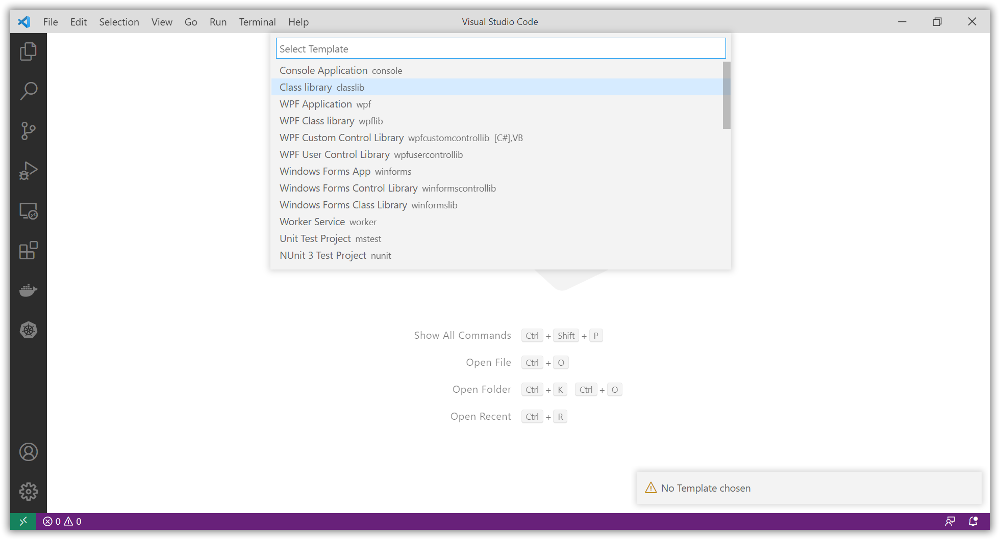
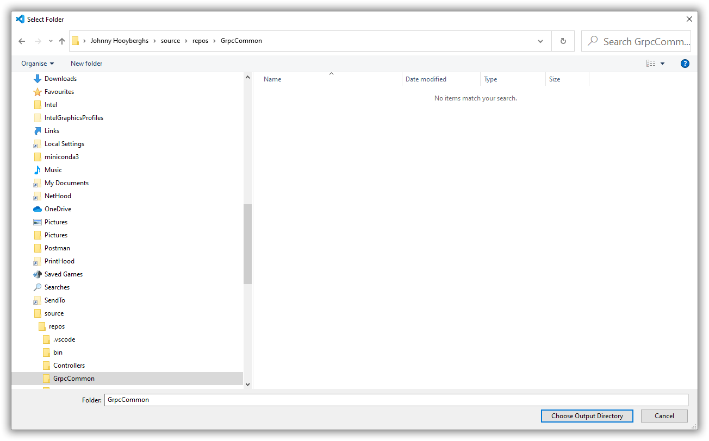
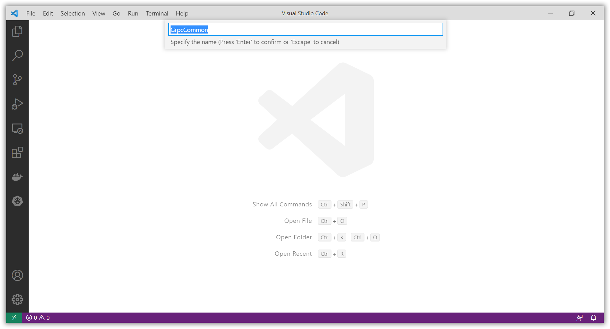

# Changing the gRPC Service and Client to use a common part

[Previous step](step-05.md) - [Next step](step-07.md)

[Link to example code inside this repository](part-1/step-06/)

Use Visual Studio Code to add a Class library that will contain the common part for our gRPC service and client:








Move the Protos folder and status.proto file from the GrpcService project to this new Class Library project and update the *.csproj file to include the Grpc.AspNetCore NuGet package and configure the status.proto file to generate both client and server code:

[GrpcCommon.csproj](part-1/step-06/GrpcCommon/GrpcCommon.csproj)

```xml
<Project Sdk="Microsoft.NET.Sdk">

  <PropertyGroup>
    <TargetFramework>net5.0</TargetFramework>
  </PropertyGroup>

  <ItemGroup>
    <PackageReference Include="Grpc.AspNetCore" Version="2.34.0" />
  </ItemGroup>

  <ItemGroup>
    <Protobuf Include="Protos\status.proto" GrpcServices="Both" />
  </ItemGroup>

</Project>
```

Remove the Protos folder and the status.proto file from both the GrpcService and WorkerService projects and add a project reference to the GrpcCommon project from both the GrpcService and WorkerService projects

[GrpcService.csproj](part-1/step-06/GrpcService/GrpcService.csproj)

```xml
<Project Sdk="Microsoft.NET.Sdk.Web">

  <PropertyGroup>
    <TargetFramework>net5.0</TargetFramework>
  </PropertyGroup>

  <ItemGroup>
    <PackageReference Include="Grpc.AspNetCore" Version="2.34.0" />
  </ItemGroup>

  <ItemGroup>
    <ProjectReference Include="..\GrpcCommon\GrpcCommon.csproj" />
  </ItemGroup>

</Project>
```

[WorkerService.csproj](part-1/step-06/WorkerService/WorkerService.csproj)

```xml
<Project Sdk="Microsoft.NET.Sdk.Worker">

  <PropertyGroup>
    <TargetFramework>net5.0</TargetFramework>
    <UserSecretsId>dotnet-WorkerService-F47A1FEB-1F5D-426D-BF50-F7977E113B0D</UserSecretsId>
  </PropertyGroup>

  <ItemGroup>
    <PackageReference Include="Grpc.Net.Client" Version="2.36.0" />
    <PackageReference Include="Microsoft.Extensions.Hosting" Version="5.0.0" />
    <PackageReference Include="Microsoft.Tye.Extensions.Configuration" Version="0.6.0-alpha.21070.5" />
    <PackageReference Include="RestSharp" Version="106.11.7" />
  </ItemGroup>

  <ItemGroup>
    <ProjectReference Include="..\GrpcCommon\GrpcCommon.csproj" />
  </ItemGroup>
  
</Project>
```

With these changes, the common Class Library can be easily re-used if you are the owner of both server and client.

[Previous step](step-05.md) - [Next step](step-07.md)