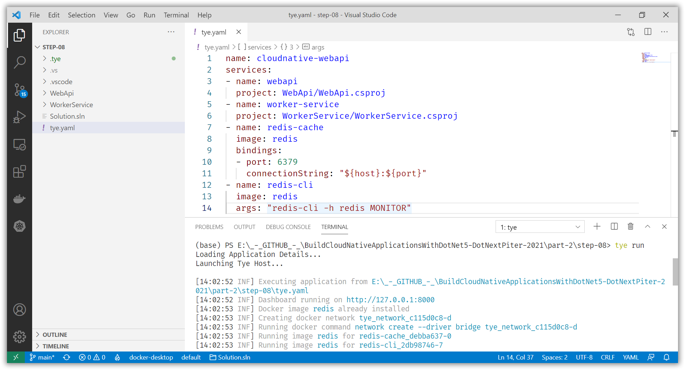
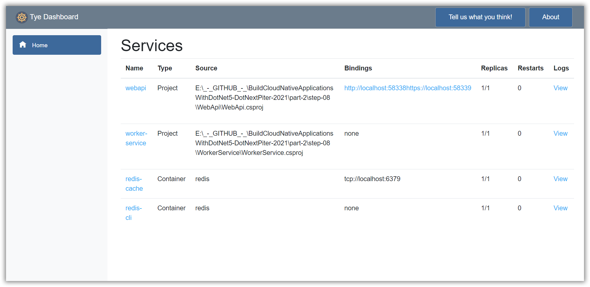
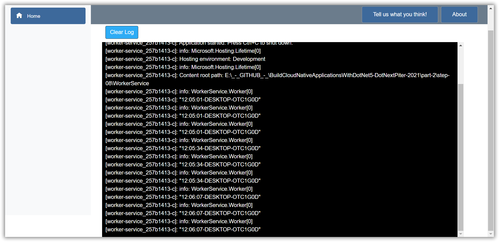
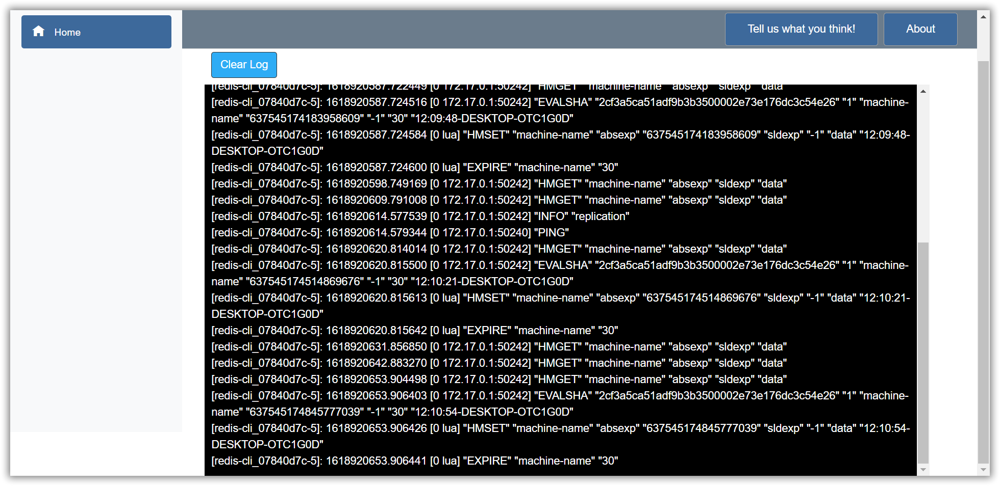

# Project Tye and additional Docker containers

[Previous step](step-07.md) - [Next step](step-09.md)

[Link to example code inside this repository](part-2/step-08/)

If we use external cloud services, we can use Project Tye to be able to run our application and these external dependencies on our local development environment.

Start by returning to the example that only uses a Worker Service and a WebApi and add a Redis distributed cache. 

Add the Microsoft.Extensions.Caching.StackExchangeRedis NuGet package to the WebApi project:

[WebApi.csproj](part-2/step-08/WebApi/WebApi.csproj)

```xml
<Project Sdk="Microsoft.NET.Sdk.Web">

  <PropertyGroup>
    <TargetFramework>net5.0</TargetFramework>
  </PropertyGroup>

  <ItemGroup>
    <PackageReference Include="Microsoft.Extensions.Caching.StackExchangeRedis" Version="5.0.1" />
  </ItemGroup>

</Project>
```

Configure the Redis cache in the Startup class:

[Startup.cs](part-2/step-08/WebApi/Startup.cs)

```csharp
using WebApi.Managers;
using Microsoft.AspNetCore.Builder;
using Microsoft.AspNetCore.Hosting;
using Microsoft.Extensions.DependencyInjection;
using Microsoft.Extensions.Hosting;
using Microsoft.Extensions.Configuration;

namespace WebApi
{
    public class Startup
    {
        public IConfiguration Configuration { get; }

        public Startup(IConfiguration configuration)
        {
            Configuration = configuration;
        }

        public void ConfigureServices(IServiceCollection services)
        {
            services.AddControllers();
            services.AddScoped<IStatusManager, StatusManager>();
            services.AddStackExchangeRedisCache(x =>
            {
                x.Configuration = Configuration.GetConnectionString("redis-cache");
            });
        }

        public void Configure(IApplicationBuilder app, IWebHostEnvironment env)
        {
            if (env.IsDevelopment())
            {
                app.UseDeveloperExceptionPage();
            }

            app.UseRouting();
            app.UseAuthorization();
            app.UseEndpoints(endpoints =>
            {
                endpoints.MapControllers();
            });
        }
    }
}
```

Use the Redis cache inside of the StatusManager:

[StatusManager.cs](part-2/step-08/WebApi/Managers/StatusManager.cs)

```csharp
using Microsoft.Extensions.Caching.Distributed;
using System;
using System.Threading.Tasks;

namespace WebApi.Managers
{
    public interface IStatusManager
    {
        Task<string> GetMachineName();
    }

    public class StatusManager : IStatusManager
    {
        private readonly IDistributedCache _distributedCache;

        public StatusManager(IDistributedCache distributedCache)
        {
            _distributedCache = distributedCache;
        }

        public async Task<string> GetMachineName()
        {
            await Task.Delay(1000);

            var cachedMachineName = await _distributedCache.GetStringAsync("machine-name");

            if (string.IsNullOrEmpty(cachedMachineName))
            {
                cachedMachineName = $"{DateTime.UtcNow:HH:mm:ss}-{Environment.MachineName}";

                await _distributedCache.SetStringAsync("machine-name", cachedMachineName, new DistributedCacheEntryOptions
                {
                    AbsoluteExpirationRelativeToNow = TimeSpan.FromSeconds(30)
                });
            }

            return cachedMachineName;
        }
    }
}
```

Update the Project Tye configuration YAML file to include a Redis cache:

[tye.yaml](part-2/step-08/tye.yaml)

```yaml
name: cloudnative-webapi
services:
- name: webapi
  project: WebApi/WebApi.csproj
- name: worker-service
  project: WorkerService/WorkerService.csproj
- name: redis-cache
  image: redis
  bindings:
  - port: 6379
    connectionString: "${host}:${port}"
- name: redis-cli
  image: redis
  args: "redis-cli -h redis MONITOR"
```

Run the project using Project Tye to see everything come together:









[Previous step](step-07.md) - [Next step](step-09.md)