# Create your own Docker images and run them as local containers

[Previous step](step-08.md) - [Next step](step-10.md)

[Link to example code inside this repository](part-2/step-09/)

Open only the WebApi project in Visual Studio Code and find the "Docker: Add Docker files to Workspace..." command:

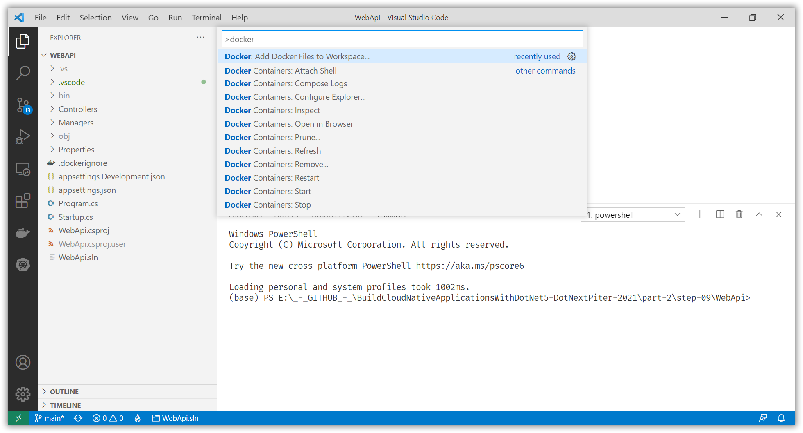

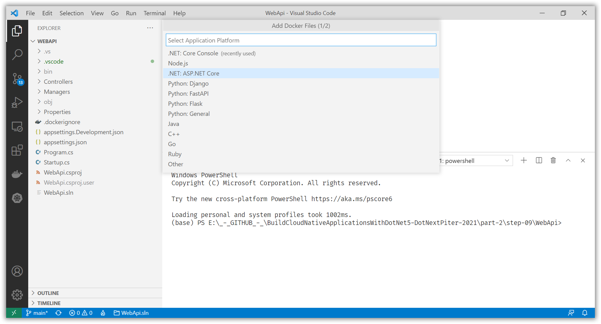

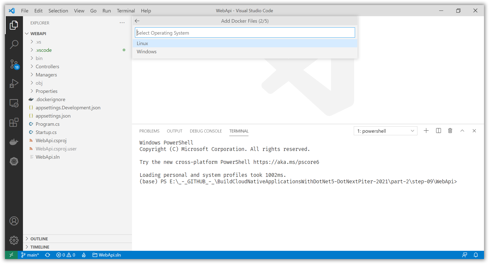

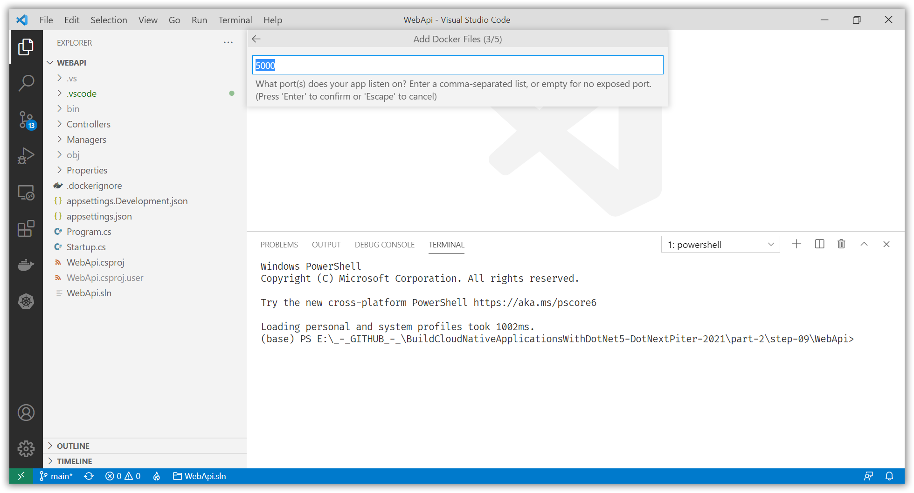

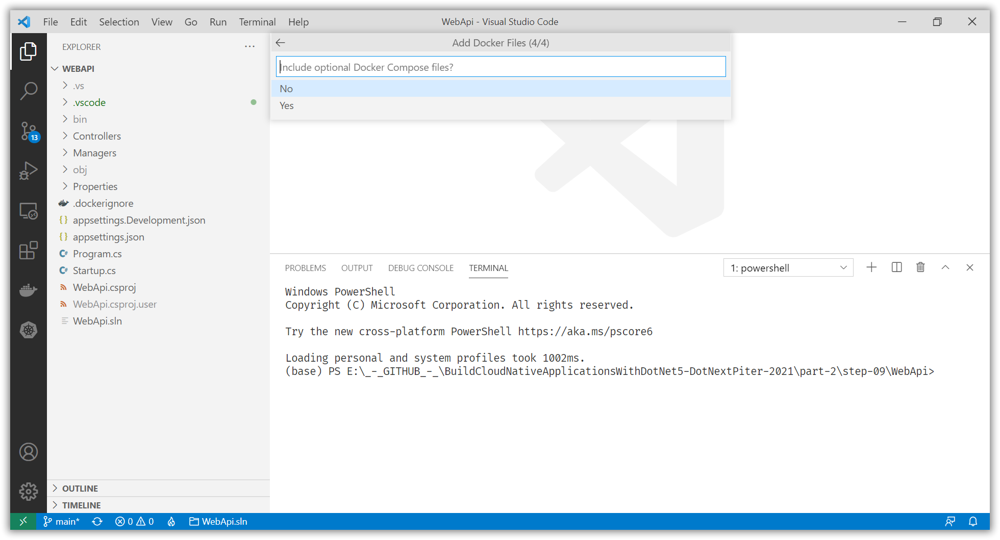

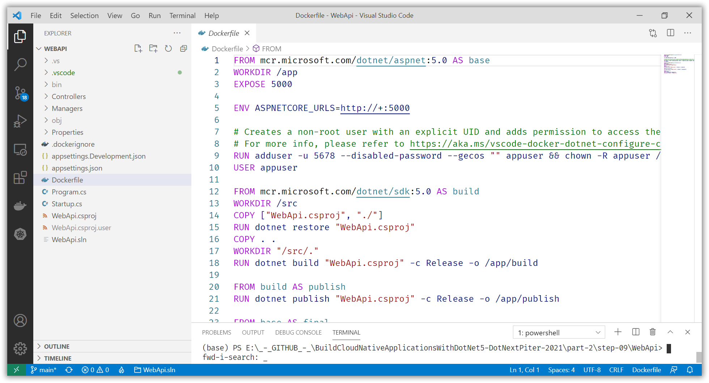

Update the Project Tye configuration YAML file to include a Redis cache:

[Dockerfile](part-2/step-09/WebApi/Dockerfile)

```dockerfile
FROM mcr.microsoft.com/dotnet/aspnet:5.0 AS base
WORKDIR /app
EXPOSE 5000

ENV ASPNETCORE_URLS=http://+:5000

# Creates a non-root user with an explicit UID and adds permission to access the /app folder
# For more info, please refer to https://aka.ms/vscode-docker-dotnet-configure-containers
RUN adduser -u 5678 --disabled-password --gecos "" appuser && chown -R appuser /app
USER appuser

FROM mcr.microsoft.com/dotnet/sdk:5.0 AS build
WORKDIR /src
COPY ["WebApi.csproj", "./"]
RUN dotnet restore "WebApi.csproj"
COPY . .
WORKDIR "/src/."
RUN dotnet build "WebApi.csproj" -c Release -o /app/build

FROM build AS publish
RUN dotnet publish "WebApi.csproj" -c Release -o /app/publish

FROM base AS final
WORKDIR /app
COPY --from=publish /app/publish .
ENTRYPOINT ["dotnet", "WebApi.dll"]
```

Right-click the Dockerfile in your editor and watch the Terminal build your Docker image.

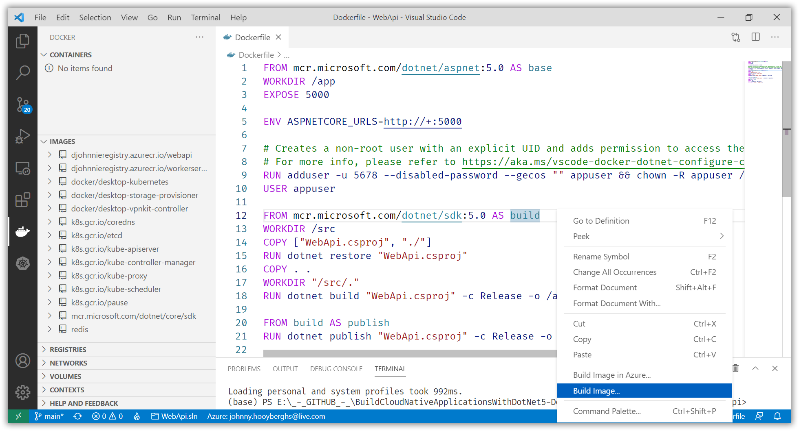

Check the Docker extension on the left-hand side to see your Docker Image available.

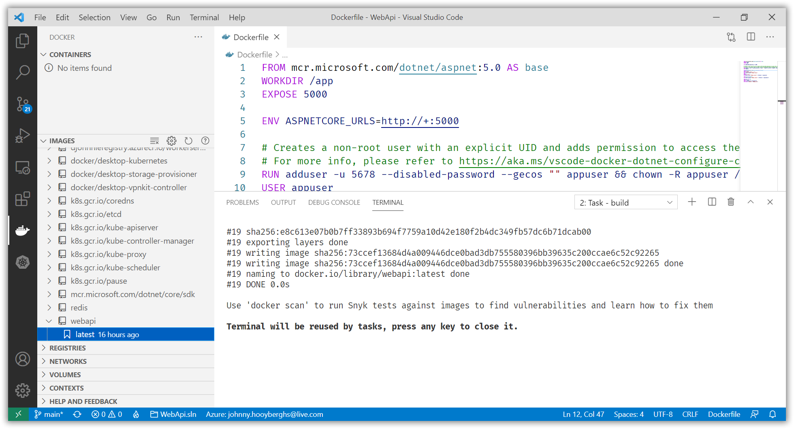

Right-click the "latest" tag and run the image.

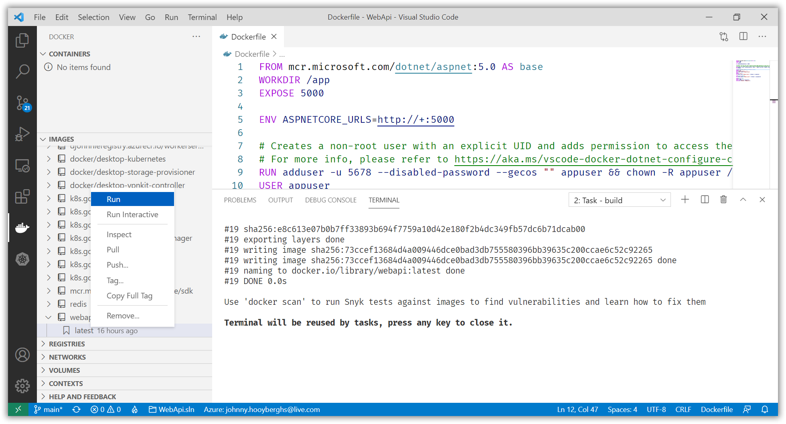

The Docker container will now run and will be available on your local machine:

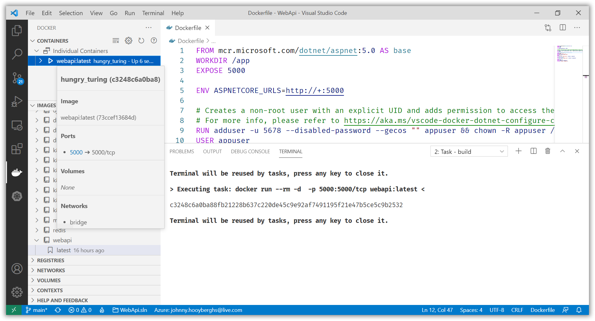

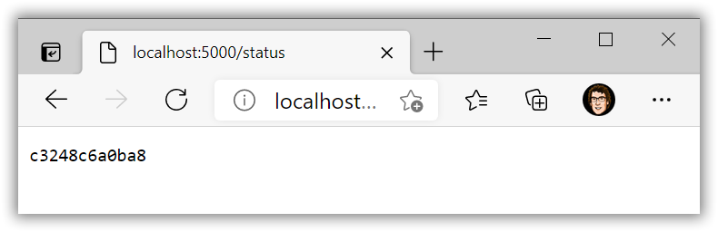

Open only the WorkerService project in Visual Studio Code and find the "Docker: Add Docker files to Workspace..." command. This time use the .NET Core Console template (because a Worker Service is not an ASP.NET web application):

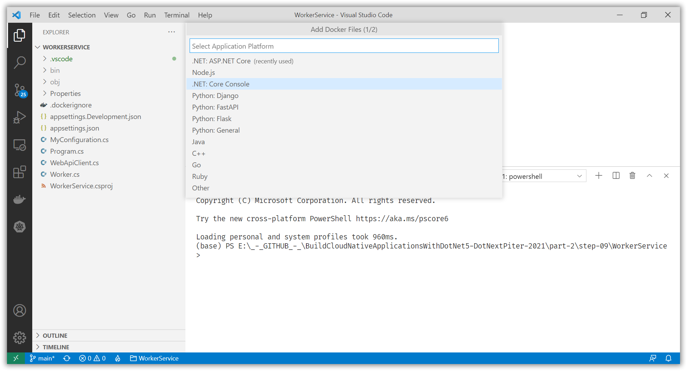

Add the "WebApiServiceUri" environment variable so the container can connect to the other WebApi container.

[Dockerfile](part-2/step-09/WorkerService/Dockerfile)

```dockerfile
FROM mcr.microsoft.com/dotnet/runtime:5.0 AS base
WORKDIR /app

ENV WebApiServiceUri=http://host.docker.internal:5000

# Creates a non-root user with an explicit UID and adds permission to access the /app folder
# For more info, please refer to https://aka.ms/vscode-docker-dotnet-configure-containers
RUN adduser -u 5678 --disabled-password --gecos "" appuser && chown -R appuser /app
USER appuser

FROM mcr.microsoft.com/dotnet/sdk:5.0 AS build
WORKDIR /src
COPY ["WorkerService.csproj", "./"]
RUN dotnet restore "WorkerService.csproj"
COPY . .
WORKDIR "/src/."
RUN dotnet build "WorkerService.csproj" -c Release -o /app/build

FROM build AS publish
RUN dotnet publish "WorkerService.csproj" -c Release -o /app/publish

FROM base AS final
WORKDIR /app
COPY --from=publish /app/publish .
ENTRYPOINT ["dotnet", "WorkerService.dll"]
```

Build the Dockerfile to an image and run it like before:

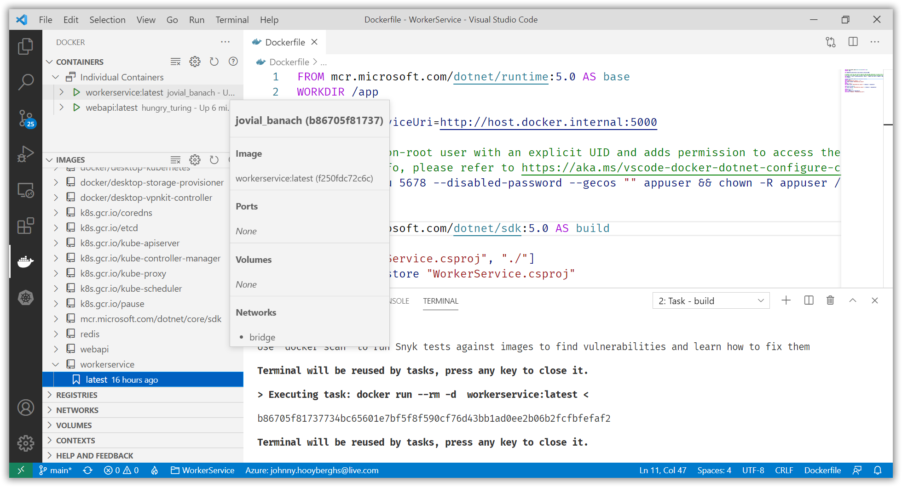
git add 
Right-click the running container to see the logging:

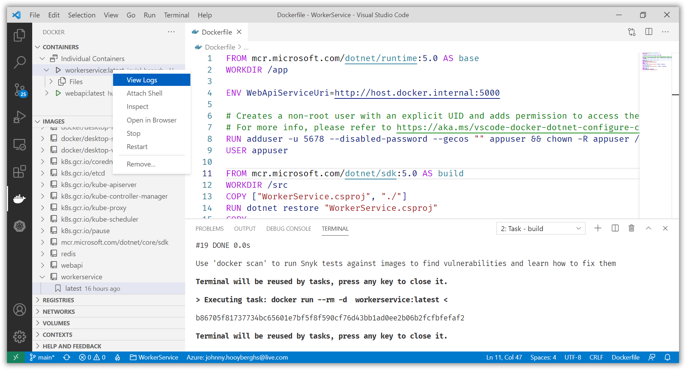

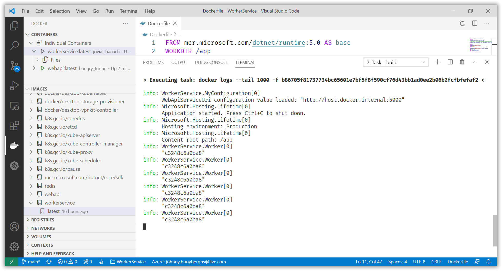

[Previous step](step-08.md) - [Next step](step-10.md)