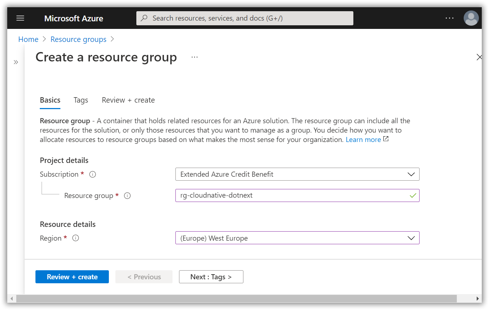
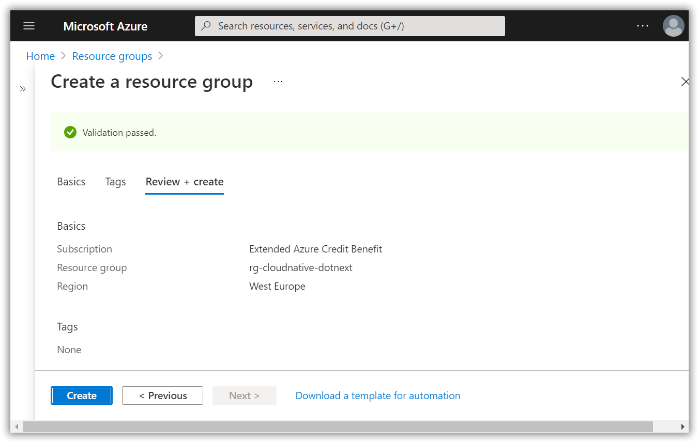

# Create a resource group in your Azure subscription

[Previous step](step-10.md) - [Next step](step-12.md)

Open the Azure Portal, login with your Azure subscription account and create a new resource group:



Create the resource group inside your selected subscription and West-Europe region:

```
rg-cloudnative-dotnext
```



[Previous step](step-10.md) - [Next step](step-12.md)