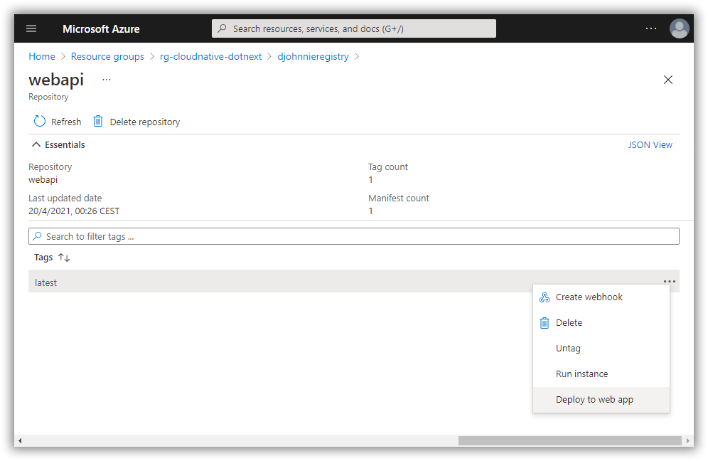
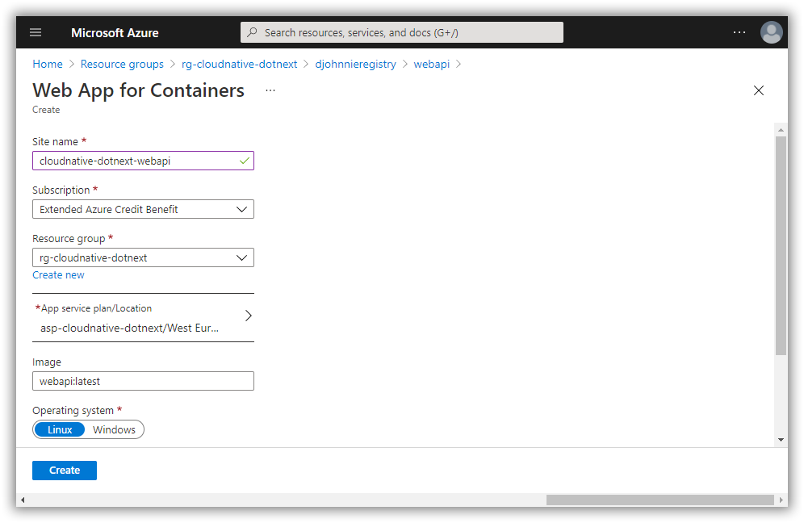
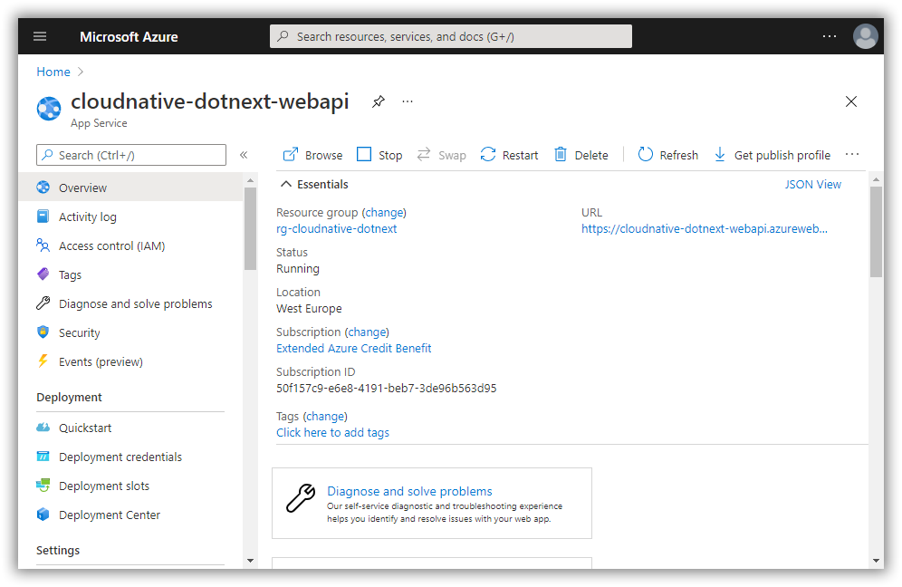
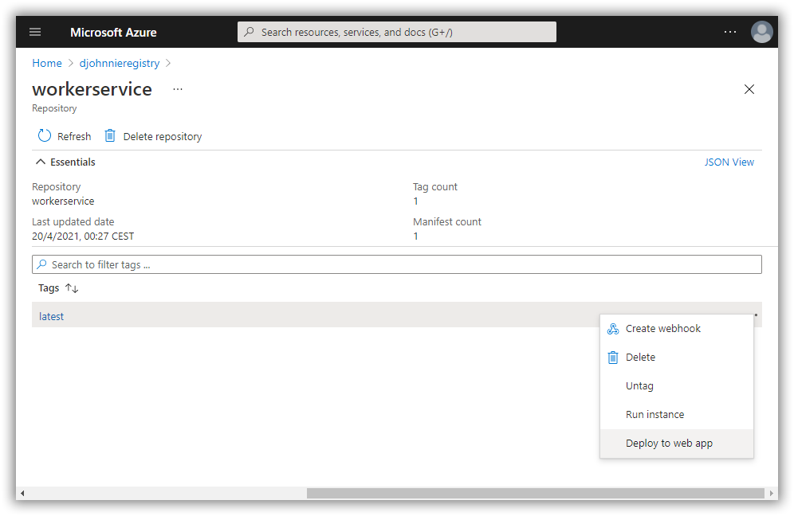
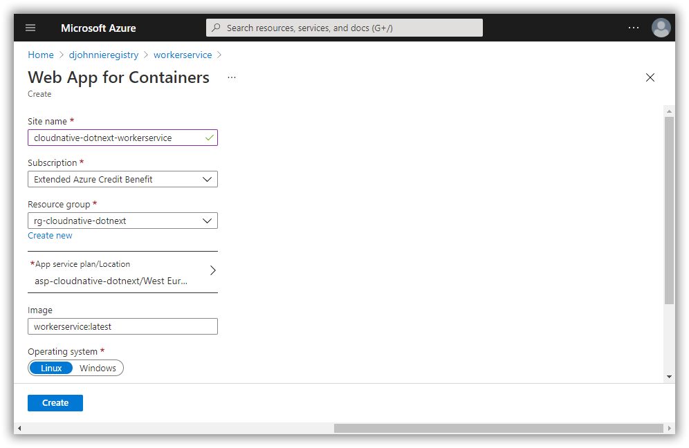
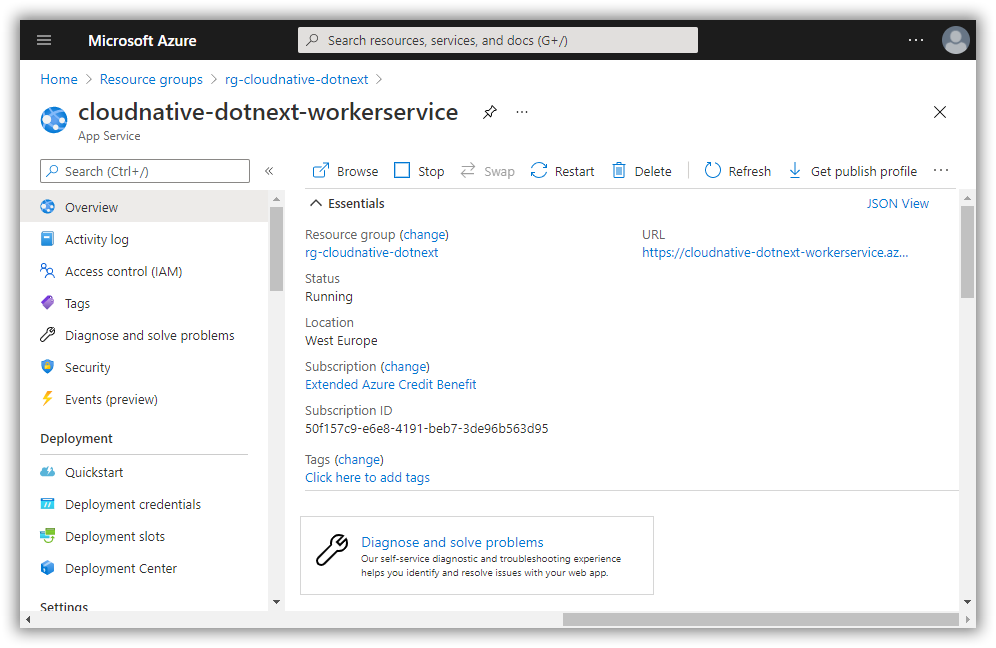
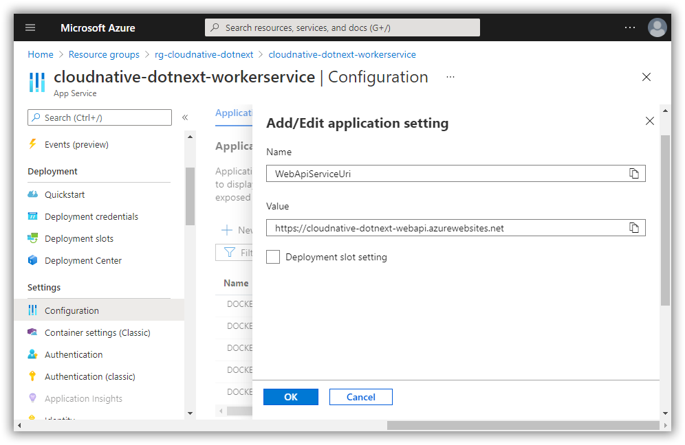
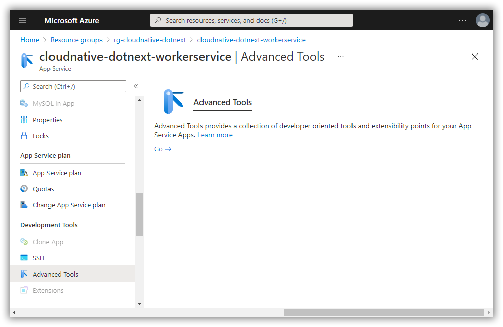
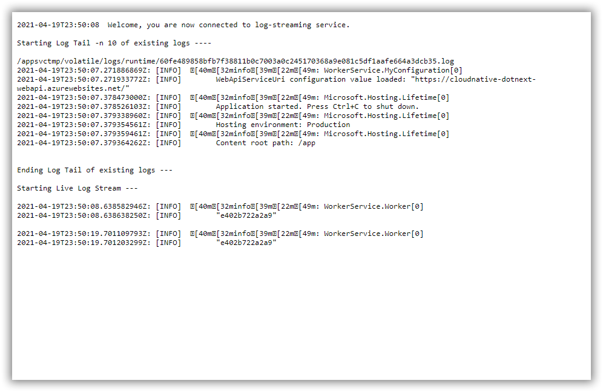

# Run your Docker containers inside Azure App Service from ACR

[Previous step](step-13.md) - [Next step](step-15.md)

After the images have been pushed to your Azure Container Registry and the admin account has been enabled, you are able to deploy the Docker containers inside an App Service.

Open the details of your Docker images inside your ACR and click the "Deploy to web app" context-menu option:

Do the same thing for the WorkerService Docker image:

The configuration for the WorkerService should contain the WebApiServiceUri. You can do this using the Configuration page inside the Azure App Service:

Now you can use the Advanced Tools page inside the Azure App Service to look at the logs from the Worker Service:

[Previous step](step-13.md) - [Next step](step-15.md)