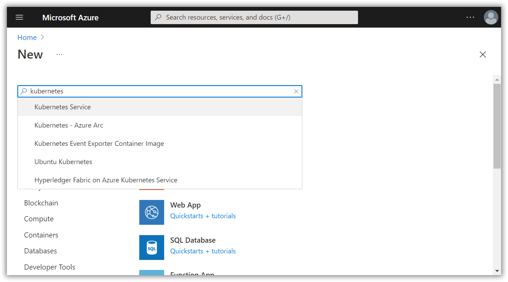
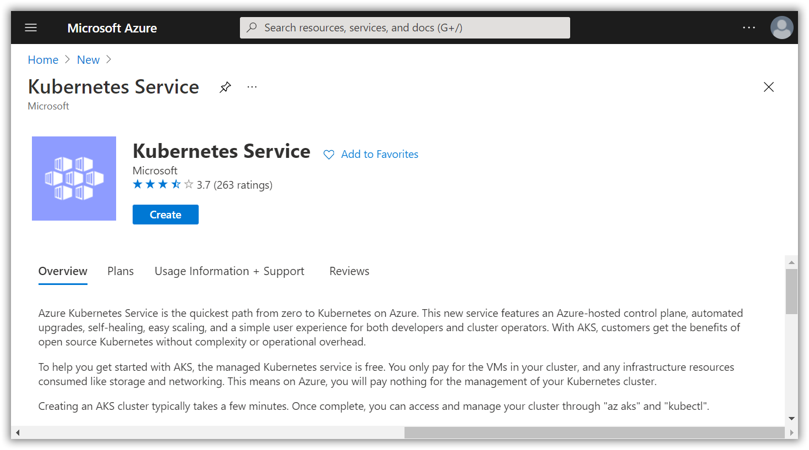
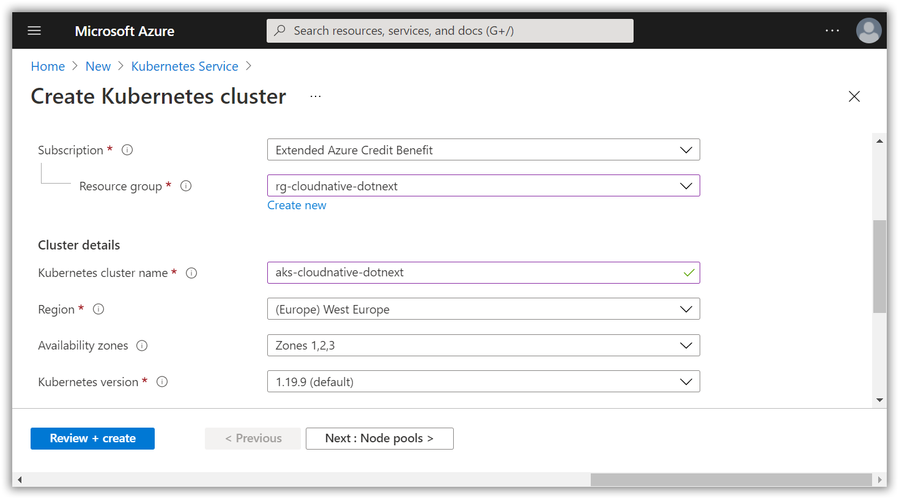
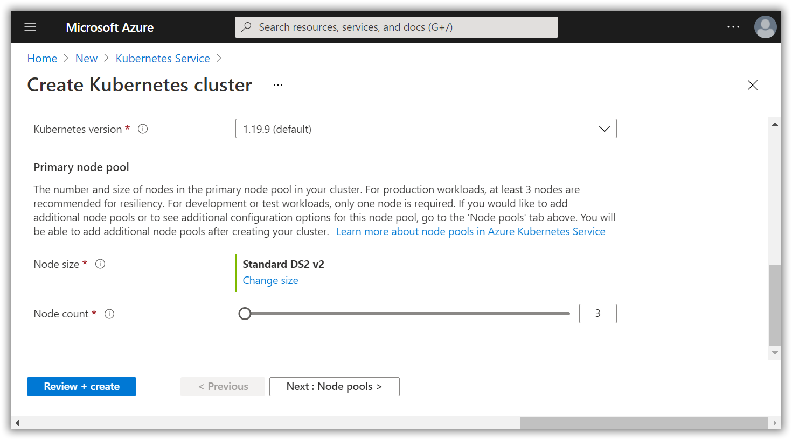
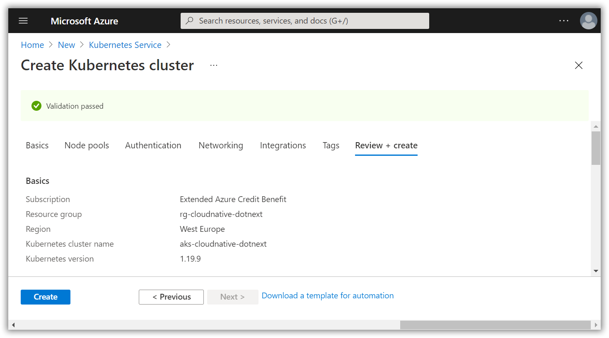

# Create the AKS (Azure Kubernetes Service) resource in your Azure subscription

[Previous step](step-14.md) - [Next step](step-16.md)

Use the Azure portal to create a new Azure Kubernetes Service:

Define the Kubernetes cluster name, region, version and node size:

[Previous step](step-14.md) - [Next step](step-16.md)