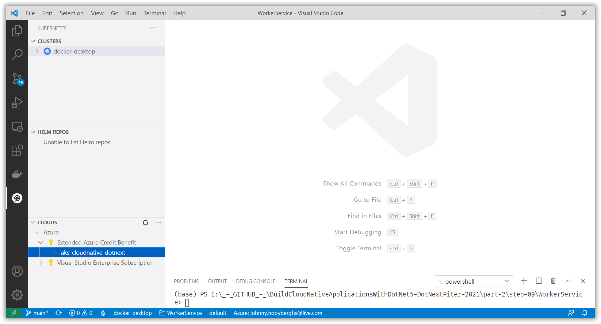
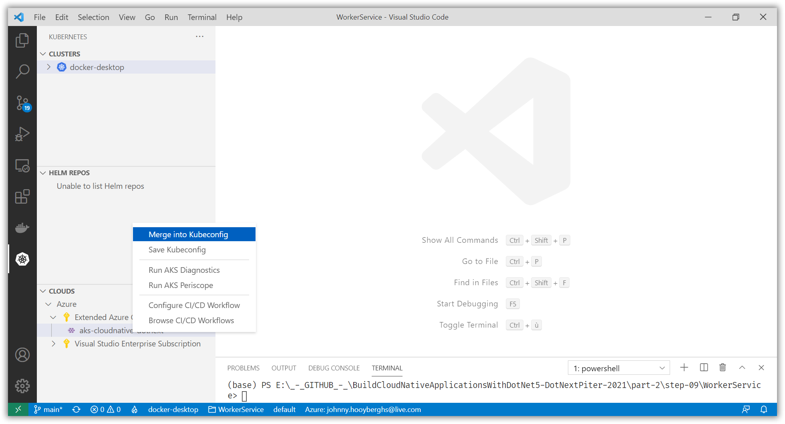
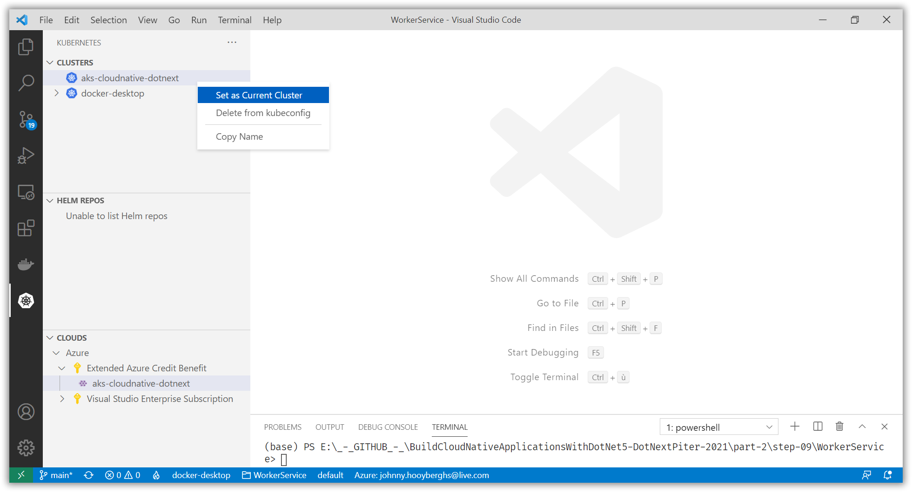

# Allow AKS to access ACR to automatically pull Docker images

[Previous step](step-15.md) - [Next step](step-17.md)

You are going to use the container registry to push Docker images to and consume them from Azure Kubernetes Service. Therefor, the Kubernetes cluster needs access (a trust relationship) with the container registry.

Execute the following command from the Visual Studio Code terminal:

```
az aks update -g <resource-group> -n <aks-name> --attach-acr <acr-name>
```

```
az aks update -g rg-cloudnative-dotnext -n aks-cloudnative-dotnext --attach-acr djohnniekefordotnext
```

Inside Visual Studio Code, open Kubernetes in the Activity Bar and select your Kubernetes cluster from the Azure Cloud pane:



Right click your Kubernetes cluster and merge it into your local Kubeconfig:



Find your Kubernetes cluster in the Clusters pane and set it as the current cluster:



[Previous step](step-15.md) - [Next step](step-17.md)