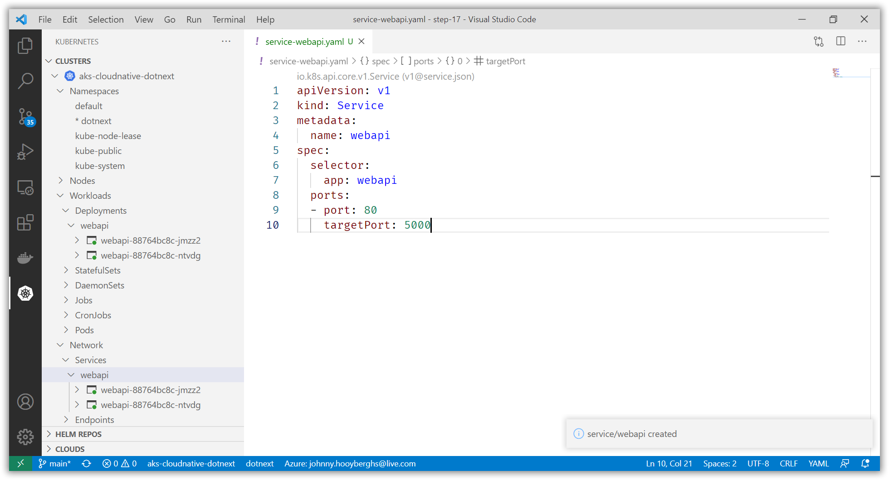

# Deploy the WebApi to AKS and create a service for it

[Previous step](step-16.md) - [Next step](step-18.md)

Select Kubernetes in the Visual Studio Code activity pane and open up your Kubernetes cluster's namespaces list:


You are going to create a new namespace. Double-click the default namespace and modify the YAML script:

```yaml
apiVersion: v1
kind: Namespace
metadata:
  name: dotnext
  resourceVersion: "144"
spec:
  finalizers:
  - kubernetes
status:
  phase: Active
```

Open the Visual Studio Code command palette and find the Kubernetes: Apply command:


Confirm the creation of the namespace and use it as the selected namespace:


Create a new file called deployment-webapi.yaml in Visual Studio Code and use the following content:

```yaml
apiVersion: apps/v1
kind: Deployment
metadata:
  name: webapi
spec:
  replicas: 2
  selector:
    matchLabels:
      app: webapi
  template:
    metadata:
      labels:
        app: webapi
    spec:
      containers:
      - name: webapi
        image: djohnniekefordotnext.azurecr.io/webapi:latest
        resources:
          limits:
            memory: "128Mi"
            cpu: "250m"
        ports:
        - containerPort: 80
```

Apply the deployment script by using the Visual Studio Code command palette:


Inside the Kubernetes Activity Bar, you should be able to find your running Pods:


In order to be able to connect to the WebApi container inside your Kubernetes Cluster, you need to add a Service:

```yaml
apiVersion: v1
kind: Service
metadata:
  name: webapi
spec:
  selector:
    app: webapi
  ports:
  - port: 80
    targetPort: 5000
```



[Previous step](step-16.md) - [Next step](step-18.md)