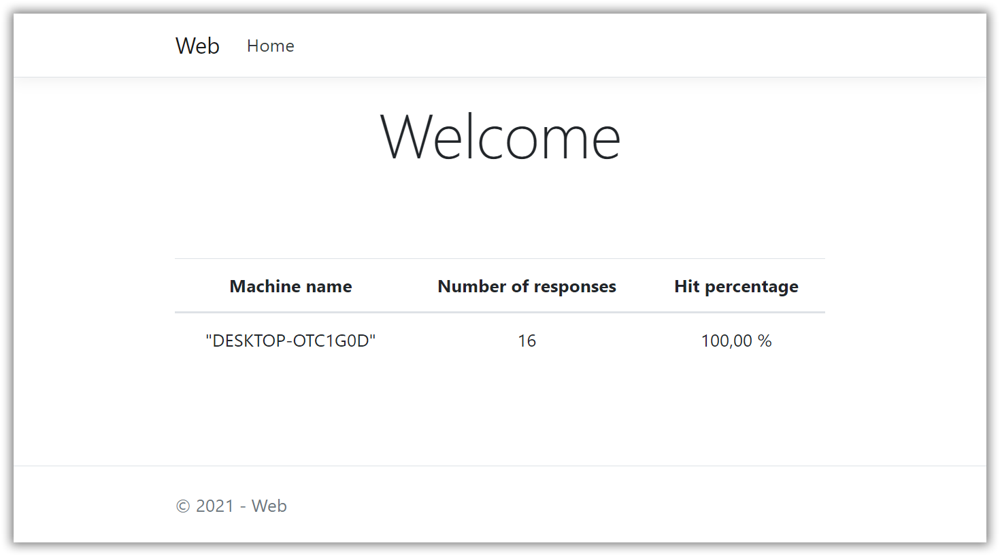
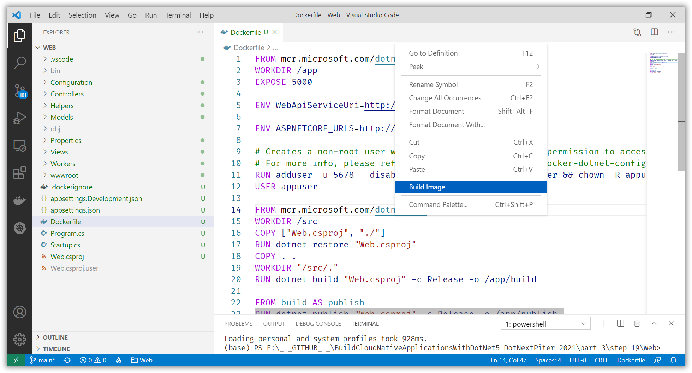
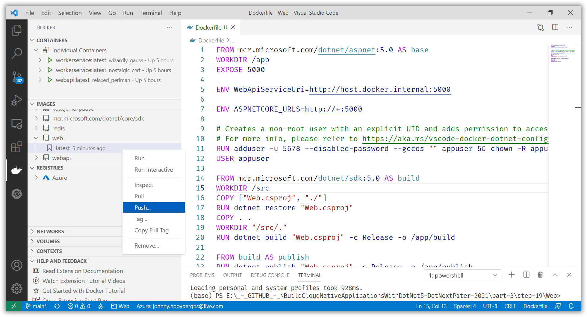
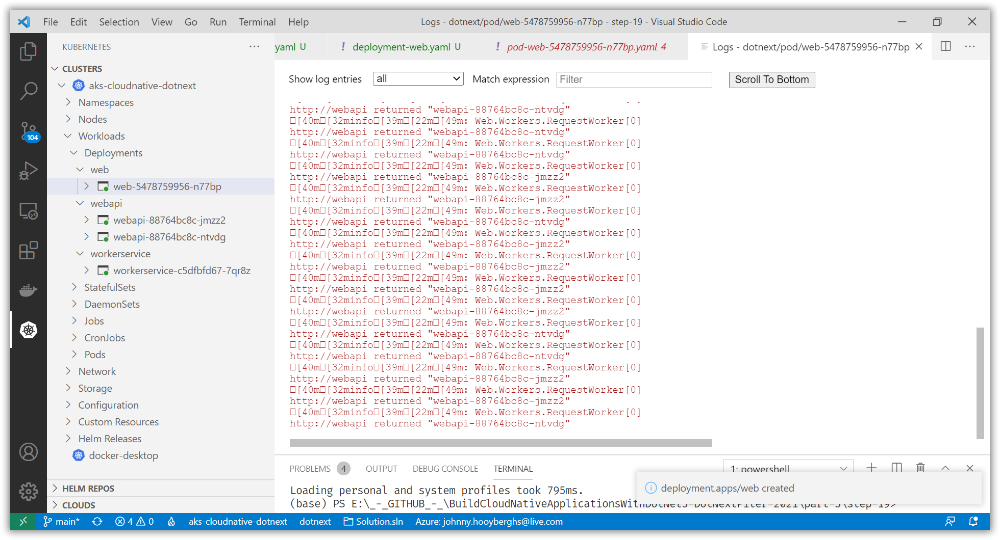
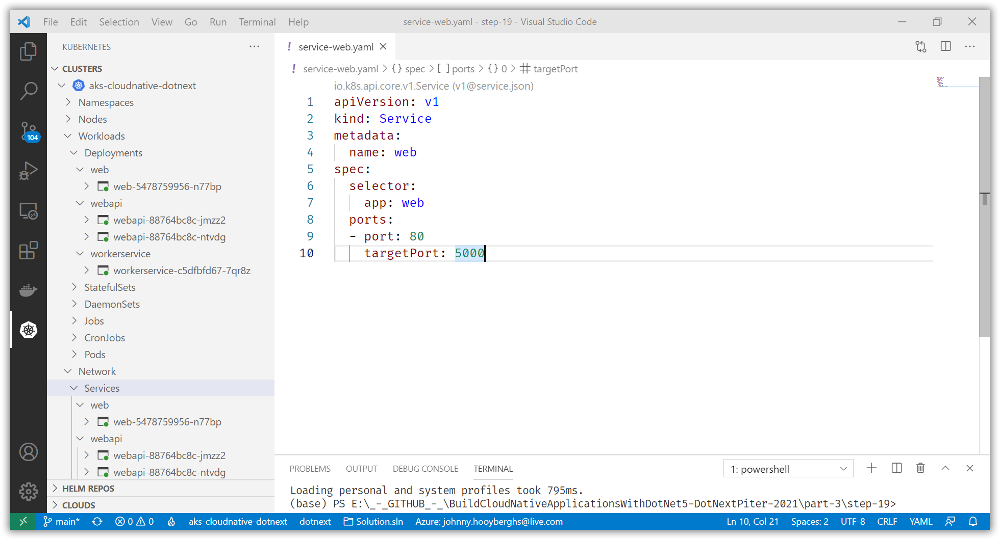

# Create an ASP.NET Core MVC Web application and deploy it to AKS

[Previous step](step-18.md) - [Next step](step-20.md)

[Link to example code inside this repository](part-3/step-19/)

Add an ASP.NET MVC Web application. Look at the link above to know how to implement a page that shows a list of requests to our WebApi.

Use Project Tye to check the MVC Homepage locally:



Create a Dockerfile, Build the Docker image and push it to our ACR.





Create a new file called deployment-web.yaml in Visual Studio Code and use the following content:

```yaml
apiVersion: apps/v1
kind: Deployment
metadata:
  name: web
spec:
  replicas: 1
  selector:
    matchLabels:
      app: web
  template:
    metadata:
      labels:
        app: web
    spec:
      containers:
      - name: webapi
        image: djohnniekefordotnext.azurecr.io/web:latest
        env:
            - name: WebApiServiceUri
              value: "http://webapi"
        resources:
          limits:
            memory: "128Mi"
            cpu: "500m"
        ports:
        - containerPort: 80
```

Apply the deployment, find the Pod and follow its logs:



If that works, we need to add a service to be able to connect to the website:

```yaml
apiVersion: v1
kind: Service
metadata:
  name: web
spec:
  selector:
    app: web
  ports:
  - port: 80
    targetPort: 5000
```

Apply the service and verify in your Kubernetes cluster:



[Previous step](step-18.md) - [Next step](step-20.md)