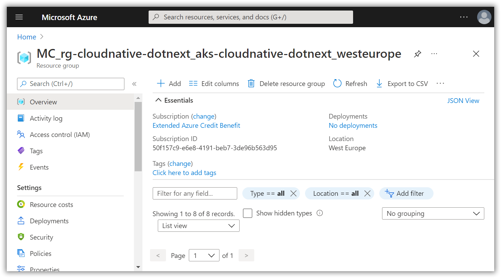
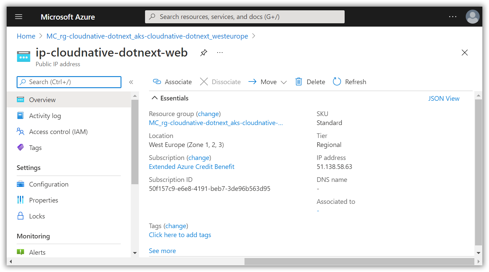
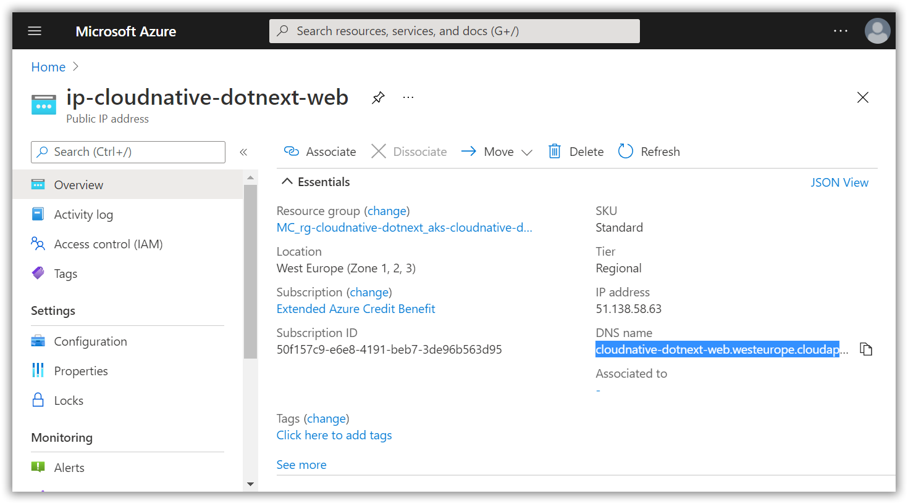

# Create a public IP-address and DNS entry

[Previous step](step-19.md) - [Next step](step-21.md)

The web application is exposed inside the Kubernetes cluster, but not accessible from the outside world. For this to work, we will need to add some things to Kubernetes and Azure.

Azure has created a seperate resource group for all Kubernetes networking components. Use the following command to learn the name of this resource group:

```
az aks show --resource-group <your resource group> --name <your aks cluster> --query nodeResourceGroup -o tsv
```

```
az aks show --resource-group rg-cloudnative-dotnext --name aks-cloudnative-dotnext --query nodeResourceGroup -o tsv
```

In my case, it outputs the following resource group:

```
MC_rg-cloudnative-dotnext_aks-cloudnative-dotnext_westeurope
```

You can find the resource group and its resources inside the Azure Portal using the search feature:



Now that you know the resource group for networking components, connected to your Kubernetes cluster, you can go ahead and use the following command to create a public IP resource:

```
az network public-ip create --resource-group <your kubernetes networking resource group> --name <public-ip resource name> --sku Standard --allocation-method static --query publicIp.ipAddress -o tsv
```

```
az network public-ip create --resource-group MC_rg-cloudnative-dotnext_aks-cloudnative-dotnext_westeurope --name ip-cloudnative-dotnext-web --sku Standard --allocation-method static --query publicIp.ipAddress -o tsv
```

If you look at the Azure Portal, you should be able to find the public-ip resource and see the actual assigned IP-address:



Using the next scripts, you update the ip-address resource with a DNS name:

```
az resource show --query id --resource-type Microsoft.Network/publicIPAddresses -n <public-ip resource name> -g <your kubernetes networking resource group>
```

```
az resource show --query id --resource-type Microsoft.Network/publicIPAddresses -n ip-cloudnative-dotnext-web -g MC_rg-cloudnative-dotnext_aks-cloudnative-dotnext_westeurope
```

This will return the full resource id for the IP. In my case:

```
"/subscriptions/50f157c9-e6e8-4191-beb7-3de96b563d95/resourceGroups/MC_rg-cloudnative-dotnext_aks-cloudnative-dotnext_westeurope/providers/Microsoft.Network/publicIPAddresses/ip-cloudnative-dotnext-web"
```

Copy this and use it to update the IP with a DNS:

```
az network public-ip update --ids "<copied-response>" --dns-name <dns-name>
```

```
az network public-ip update --ids "/subscriptions/50f157c9-e6e8-4191-beb7-3de96b563d95/resourceGroups/MC_rg-cloudnative-dotnext_aks-cloudnative-dotnext_westeurope/providers/Microsoft.Network/publicIPAddresses/ip-cloudnative-dotnext-web" --dns-name cloudnative-dotnext-web
```




[Previous step](step-19.md) - [Next step](step-21.md)